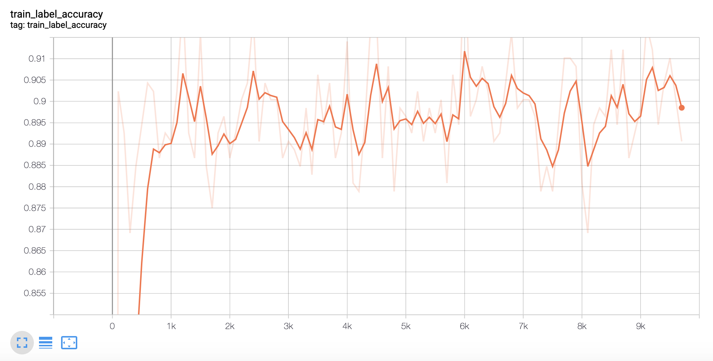

## Test [simclr](https://paperswithcode.com/paper/a-simple-framework-for-contrastive-learning) with [Weights & Biases](https://www.wandb.com)

This document is a step-by-step guide to do hyperparameter tuning for simclr using W&B.

### Summary of the changes

The change to add wandb API calls is minimal, from [run.py](run.py) (without using wandb) to 
[run_sweep.py](run_sweep.py) (with wandb). There is only one additional dependency in the docker environment:
```dockerfile
RUN pip install wandb
``` 

### Set up

We use docker to run simclr pretraining and finetuning, on Nvidia GPU Tesla V100.
```shell script
make container
```

We also use docker to run W&B sweep.
```shell script
make wandb_container WANDB_BASE_URL=http://wandb.host:port
```

### Pretrain simclr with CIFAR-10

To pretrain the model on CIFAR-10 with a single GPU, try the following command:
```shell script
make simclr DATA_DIR=/host/path/data

# inside docker
tf-docker /app > make run_pretrain DATA_DIR=/data/cifar10 MODEL_DIR=/data/cifar10_model |& tee run_pretrain.log
```

### Finetune simclr with CIFAR-10

To fine-tune a linear head (with a single GPU), try the following command:
```shell script
make simclr DATA_DIR=/host/path/data

# inside docker
tf-docker /app > make run_finetune DATA_DIR=/data/cifar10 CHECKPOINT=/data/cifar10_model MODEL_DIR=/data/cifar10_model_ft |& tee run_finetune.log
```

As a reference, the above runs on CIFAR-10 should give you around 91% accuracy, which will be used to compare with W&B.

### Create W&B sweep

First create a W&B project simclr.

Use the example sweep configuration in [finetune_cifar10_wandb.yaml](finetune_cifar10_wandb.yaml) to create a sweep:
```shell script
make create_sweep WANDB_DIR=... WANDB_USERNAME=... WANDB_API_KEY=... WANDB_PROJECT=simclr SWEEP_CONFIG=...
```
Make sure that the single quotes are removed in the configuration for
```yaml
--variable_schema=(?!global_step|(?:.*/|^)LARSOptimizer|head))
```
Record the sweep id, and use it in the next section.

### Start W&B sweep

```shell script
make start_sweep WANDB_DIR=... WANDB_USERNAME=... WANDB_API_KEY=... WANDB_PROJECT=simclr SWEEP_ID=...
```

### Comparison


<div align="center">
  Finetune Result for CIFAR10
</div>


<div align="center">
  Finetune Result for CIFAR10 with W&B Sweep
</div>

Weight Decay | Clock Time | Top 1 Label Accuracy | Top 5 Label Accuracy
:--- | :--- | :--- | :---
0 | 14m | 0.9116 | 0.9975
0.001 | 14m | 0.9073 | 0.9974
0.00001 | 14m | 0.9116 | 0.9976
